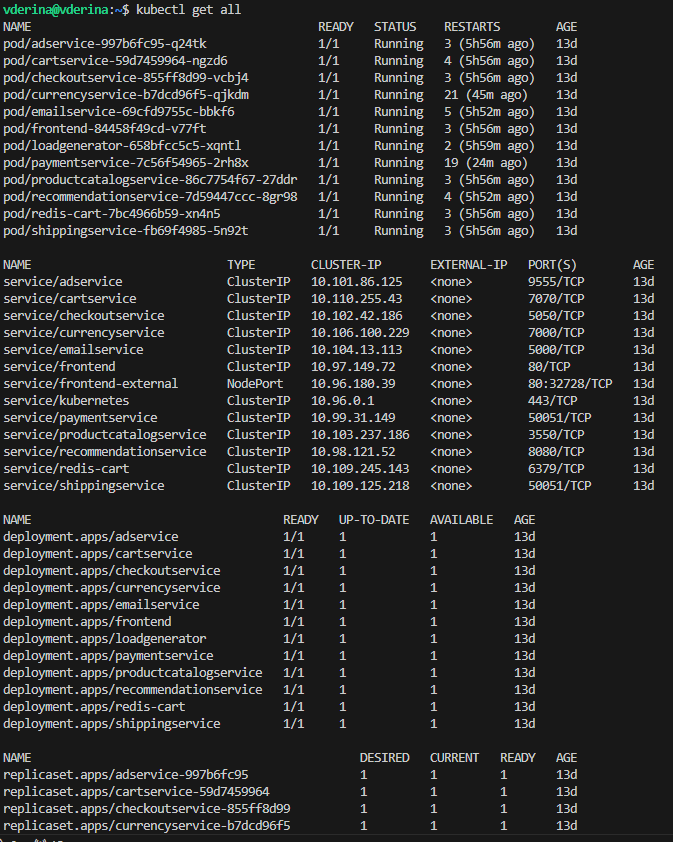

В проекте было использовано демонстрационное приложение ["E-commerce"](https://github.com/GoogleCloudPlatform/microservices-demo).

Подробнее о логике работы приложения на странице: [Reverse engineering приложения "E-commerce"](https://vladaderina.github.io/KubeAnomaly/e-commerce-theory/).


#### 1 шаг. Развертывание микросервисного приложения с помощью helm

1. Клонируем репозиторий:
```
helm pull oci://us-docker.pkg.dev/online-boutique-ci/charts/onlineboutique --untar
```

2. Меняем в манифесте `microservices-demo/helm-chart/templates/frontend.yaml` тип сервиса с LoadBalancer на NodePort

3. Развертываем приложение в кластере с помощью helm:
```
helm upgrade onlineboutique ./onlineboutique --install --create-namespace -n shop
```

Все развернулось успешно:


#### 3 шаг. Настройка внешнего доступа к кластеру

По умолчанию Minikube не пробрасывает порты Kubernetes на хост. Можно пойти двумя путями:

**1 вариант.** Использовать проброс портов через kubectl port-forward (уровень приложения, туннелирование через API Kubernetes) через команду:

```
kubectl port-forward --address 0.0.0.0 service/frontend-external 32728:80 &>/dev/null &
```

Чтобы посмотреть PID процесса на порту 8080:
```
sudo lsof -i :8080
```

Как это работает?

- kubectl связывается с kube-api.
  
- kube-api находит под, связанный с сервисом frontend-external, и устанавливает соединение с ним.
  
- kubectl создает TCP-порт на локальном компьютере (127.0.0.1:32728). Этот порт связан с портом 80 пода, который обслуживает сервис frontend-external.
  
- После обращения к http://localhost:32728, kubectl перехватывает этот запрос и передает его через kube-api в под, связанный с сервисом frontend-external.
  
- Ответ от пода передается обратно через API Kubernetes и возвращается на локальный порт 32728.

**2 вариант.** Получить доступ к виртуальной машине, а затем доступ к приложению через NodePort.

**Адрес хоста: 192.168.75.123**

**Адрес сервера с гипервизором: 192.168.75.11**

**Адрес виртуальной машины с minikube на сервере: 192.168.39.24**

Сначала на локальной машине, которая находится в одной сети с сервером, нужно настроить маршрутизацию через шлюз.
Это нужно для того, чтобы все пакеты к ip адресам из сети 192.168.0.0/16 виртуальной машины отправлялись через сервер 192.168.75.11, так как сервер имеет интерфейс 192.168.39.1 для доступа к сети.

Изначально в Windows PowerShell от администратора была выполнена команда:
```
route add 192.168.0.0 mask 255.255.0.0 192.168.75.123
```
По итогу вывод **route print** показал:
```
Network Destination        Netmask          Gateway       Interface         Metric
192.168.0.0                255.255.0.0      On-link       192.168.75.123     26
```
Эта запись указывает, что сеть 192.168.0.0/16 находится "на связи" (On-link) с интерфейсом 192.168.75.123. Что не верно, ведь мы хотели добиться того, чтобы шлюзом был сервер.

Поэтому команда была выполнена повторно с нужным IP адресом в качестве шлюза и с флагом `-p` (persistent):
```
route add 192.168.0.0 mask 255.255.0.0 192.168.75.11 -p
```
Теперь вывод `route print` показал две записи:
```
Network Destination        Netmask          Gateway       Interface         Metric
192.168.0.0                255.255.0.0      On-link       192.168.75.123     26
192.168.0.0                255.255.0.0      192.168.75.11   192.168.75.123   26
```
Пробуем добраться до виртуальной машины:


По итогу шлюз не сработал, потому что в таблице маршрутизации есть две записи с одинаковой метрикой (приоритетом). В таких случаях система выбирает первую подходящую запись и отправляет пакеты по правилам, указанным в ней, игнорируя вторую запись.

Чтобы шлюз заработал, нужно было не забыть удалить ту неверную запись ИЛИ уменьшить значение метрики для приоритетной записи, например:
```
route delete 192.168.0.0 mask 255.255.0.0 192.168.75.123
```
или
```
route change 192.168.0.0 mask 255.255.0.0 192.168.75.11 metric 10
```

Пробуем еще раз:


Шлюз заработал.

Теперь нужно на сервере включить пересылку пакетов между интерфейсами.

Для этого открываем файл `/etc/sysctl.conf` и добавляем строку:
```
net.ipv4.ip_forward=1
```

Применяем изменения:
```
sudo sysctl -p
```

Все еще нет доступа:


В поисках проблемы, проверяем таблицу маршрутизации на сервере:

```
ip route
```


Для сети 192.168.39.0/24 есть маршрут, так что сервер 192.168.75.11 после получения пакетов от хоста знает, как отправить их отправить ВМ.

Была теория, ICMP-трафик заблокирован. Были добавлены правила:
```
sudo iptables -A INPUT -p icmp --icmp-type echo-request -j ACCEPT
sudo iptables -A OUTPUT -p icmp --icmp-type echo-reply -j ACCEPT
```

Но результат тот же:


Команда для проверки какой виртуальный интерфейс к какому мосту подключен:

```
bridge link show
```


Команда для анализа сетевого трафика:

```
sudo tcpdump -i any host 192.168.75.123 and icmp
```


Видим, информацию о том, что пакет с IP 192.168.75.123 был отправлен виртуальной машине 192.168.39.24, однако в следующей записи устройство с IP-адресом 192.168.75.11 сообщило устройству 192.168.75.123, что адрес 192.168.39.24 недоступен.

Проверим настройки файерволла на сервере (192.168.75.11).

Проверка правил iptables с использованием команды:
```
sudo iptables -L -v -n
```


!!! note "Пояснения к chains, управляемыми libvirt"

    **LIBVIRT_FWI** - цепочка управляет **входящим** трафиком, который проходит через интерфейсы **виртуальных мостов**

    **LIBVIRT_FWO** - цепочка управляет **исходящим** трафиком, который проходит через интерфейсы **виртуальных мостов**

    **LIBVIRT_FWX** - цепочка управляет **пересылкой** трафика между интерфейсами **виртуальных мостов**

    **LIBVIRT_INP** - цепочка управляет **входящим** трафиком на интерфейсы **виртуальных машин**

    **LIBVIRT_OUT** - цепочка управляет **исходящим** трафиком от интерфейсов **виртуальных машин**

!!! note "Общая структура правил iptables"

    **pkts:** Количество пакетов, обработанных этим правилом.

    **bytes**: Общий объем данных (в байтах), обработанных этим правилом.

    **target**: Действие, которое будет выполнено, если пакет соответствует правилу (например, ACCEPT, REJECT, DROP).

    **prot**: Протокол (например, 0 — все протоколы, tcp, udp, icmp).

    **opt**: Дополнительные опции (часто не используется и обозначается как --).

    **in**: Входной интерфейс (например, virbr0, virbr1).

    **out**: Выходной интерфейс.

    **source**: Источник трафика (IP-адрес или подсеть).

    **destination**: Назначение трафика (IP-адрес или подсеть).

Видим блокирующие правила **REJECT** (отправляет уведомление о сбросе пакета удалённому хосту, в то время как DROP — просто рубит без уведомления) у цепочек **LIBVIRT_FWI** и **LIBVIRT_FWO** для всех протоколов с отправкой сообщения `icmp-port-unreachable`.

Таким образом, прошлая команда по изменению правил iptables была выполнена *не для тех цепочек*.

Вставляем в начало цепочек ACCEPT правила для всего входящего трафика, который направлен на все виртуальные мосты:

```
sudo iptables -I LIBVIRT_FWI 1 -j ACCEPT
sudo iptables -I LIBVIRT_FWO 1 -j ACCEPT
```


Пинг успешно проходит, сайт с хоста 192.168.75.123 открывается по запросу http://192.168.39.24:32728/

