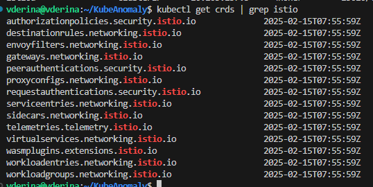
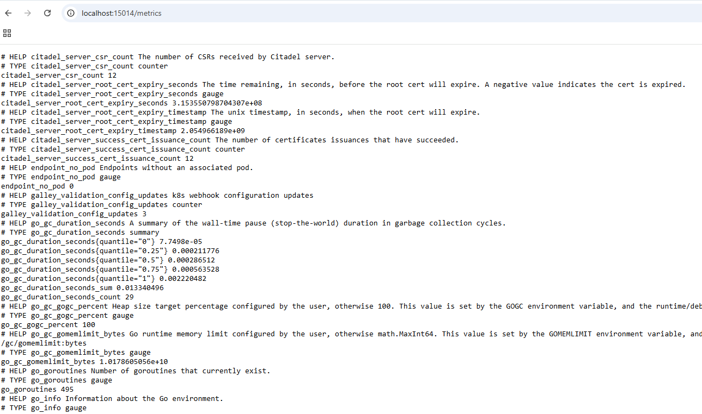

## Установка Isio Operator

1. Установка IstioCtl

На сервере установим IstioCtl:

```
curl -L https://istio.io/downloadIstio | sh -
cd istio-*
sudo mv ./bin/istioctl /usr/bin/
```

Проверим версию:


2. Создание манифеста IstioOperator

Создаем файл `istio-operator.yaml`:

```
apiVersion: install.istio.io/v1alpha1
kind: IstioOperator
metadata:
  name: istio-control-plane
  namespace: istio-system
spec:
  profile: minimal
  meshConfig:
    defaultConfig:
      proxyMetadata:
        ISTIO_META_DNS_CAPTURE: "true"
        ISTIO_META_DNS_AUTO_ALLOCATE: "true"
  values:
    telemetry:
      enabled: true
```

3. Установка Istio в кластер

```
istioctl install -f istio-operator.yaml --set profile=minimal -y
```

!!! note "Пояснение к команде istioctl install"
    1. Определяет текущий контекст `kubectl config current-context`
    2. Проверяет совместимость версии Istio с кластером
    3. Проверяет, установлен ли уже Istio (kubectl get namespace istio-system)
    4. Если CRD Istio еще нет в кластере, istioctl install создает их: `kubectl apply -f https://github.com/istio/istio/releases/latest/download/samples/operator/crd.yaml`
    5. Если его istio-system namespace нет - создает его
    6. На основе профиля (default) и манифеста istio-operator.yaml разворачивает компоненты в istio-system


!!! note "Как istioctl понимает, что устанавливать?"

    istioctl install использует комбинацию параметров:

    1. Профиль установки (--set profile=default):

    Определяет, какие компоненты Istio включить (например, Ingress, Egress, Telemetry).
    Можно задать minimal, default, demo или кастомный профиль. [Официальная документация](https://istio.io/latest/docs/setup/additional-setup/config-profiles/). 

    2. Файл конфигурации (-f istio-operator.yaml):

    Позволяет переопределить стандартные параметры установки.
    Включает такие настройки, как proxyMetadata, telemetry.enabled, meshConfig.

4. Проверка установки Istio

```
kubectl get crds | grep istio
```



```
kubectl get pods -n istio-system
```


```
kubectl get svc -n istio-system
```


## Настройка сбора метрик с Isio

1. Включение auto-injection

Auto-injection включается аннотацией istio-injection=enabled в нужном namespace:

```
kubectl label namespace product istio-injection=enabled
```

Теперь при деплое новых подов сайдкар будет автоматически добавляться. 

2. Обновление существующих подов

```
kubectl rollout restart deployment -n product
```

После обновления у всех подов появились sidecar контейнеры istio:


3. Проверка, что Istio отдает метрики

```
kubectl port-forward -n istio-system svc/istiod 15014:15014
curl http://localhost:15014/metrics
```



## Настройка scraping для VictoriaMetrics

Добавим конфигурацию для VMServiceScrape:

```
apiVersion: operator.victoriametrics.com/v1beta1
kind: VMServiceScrape
metadata:
  name: istio-mesh-scrape
  namespace: monitoring
  labels:
    app: istio-mesh
    component: metrics
spec:
  endpoints:
    - port: "15014"
      path: /metrics
      interval: 15s
      scheme: http
      targetPort: 15014
  selector:
    matchLabels:
      app: istiod
      release: istio
  namespaceSelector:
    matchNames:
      - istio-system
```

kubectl run -n monitoring -it --rm --image=busybox dns-test -- nslookup istiod.istio-system.svc.cluster.local

kubectl run -n monitoring -it --rm --image=curlimages/curl curl-test -- curl http://istiod.istio-system.svc.cluster.local:15014/metrics